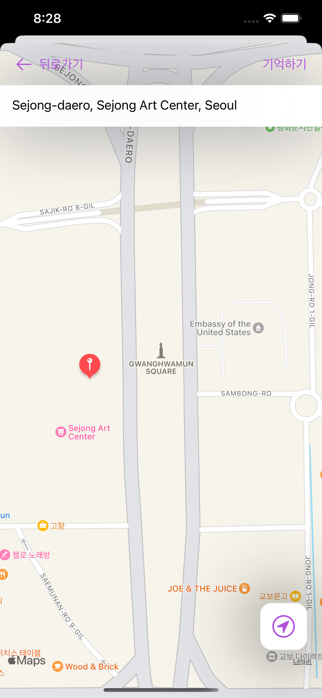
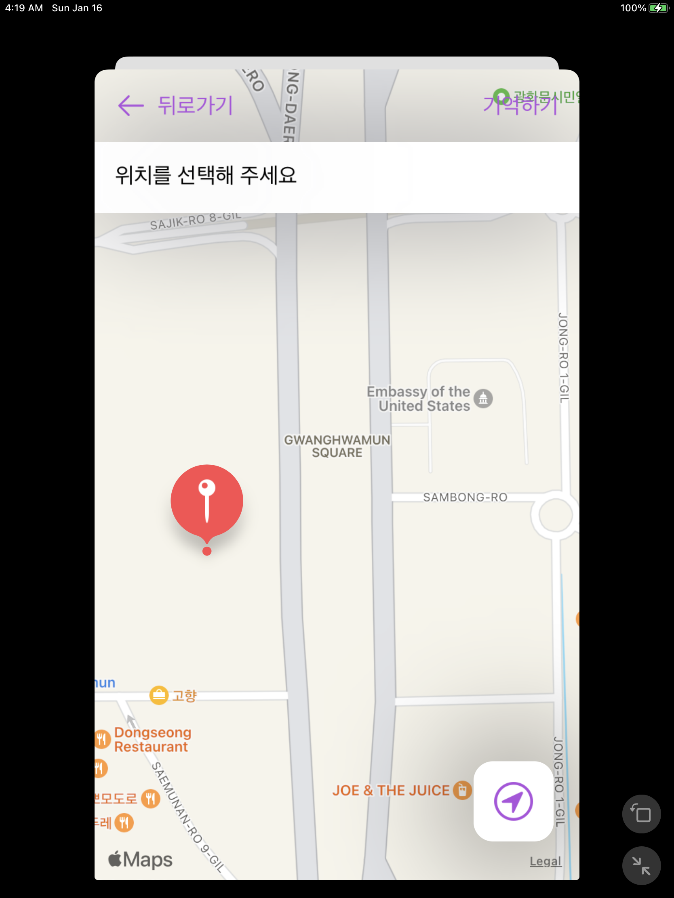

# ios-map-quest

ios 심사관련 질문

## 질문내용

### 현재 상황
* testflight에서의 테스트에서는 버그가 심사시에 거절당한 버그가 없음
* 버그 재현이 안됨

### 테스트 기기
1. iPhone 13, iPhone 13 pro max

### 기능 설명
맵을 터치하면 해당 핀이 생긴 위치의 주소정보가 상단의 '위치를 선택해 주세요'부분에 표시가 됨

### 심사시 발생한 버그 내용
맵을 터치해도 주소 취득이 되질 않아서 상단의 상태창의 내용이 변경이 안됨

#### 단말기 테스트

#### 앱 심사거부 샘플

